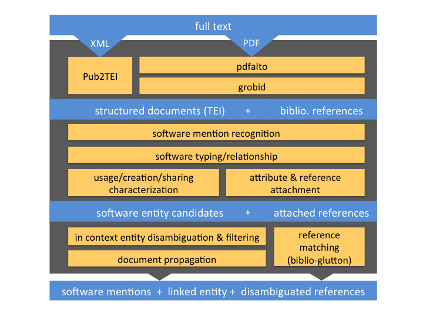
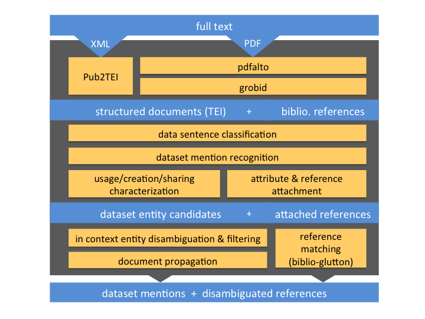

**Keywords**: research software, research data, open access, open science, scientometrics

# Abstract

There is today no standard way for referencing research datasets and research software in scientific communication. Emerging editorial workflows and supporting infrastructures dedicated to dataset and software are still poorly adopted by current publishing practices and are highly fragmented.

To better follow the production of research datasets and software, we present a text mining method applied to scientific publications at scale and implemented at the French national level.
Our approach relies on state-of-the-art Machine Learning and document engineering techniques to ensure satisfactory accuracy across multiple research areas and document types, combining full-text harvesting, mention extraction, context characterization and corpus-level analysis. 

The annotations produced by our system are used by the French Open Science Monitor (BSO) [platform](https://frenchopensciencemonitor.esr.gouv.fr) to follow the production and the openness of research data and software, in the context of the second National Plan for Open Science.

The source code and the data of the French Open Science Monitor, as well as all the associated tools and training datasets, are available under open licences.

# 1. Introduction

## Motivations

Datasets and software are today core elements of the research activities. 90-95% of researchers in the US and the UK rely upon software, and more than 60% would be unable to continue working if such software stopped functioning [@olivier_philippe_2019_2585783]. Nearly half of the researchers commonly use data generated by other scientists [@science_2011] and the vast majority of researchers support data sharing [@10.1371/journal.pone.0134826]. The critical role of research data and software is today broadly acknowledged, in particular for better supporting the reuse and the reproducibility of research results [,@LAURINAVICHYUTE2022104332]. 

However, in contrast with the well established practice of citing publication, the visibility of research datasets and software is considered largely insufficient. Software is not cited in scholarly publications in a consistent and easily readable manner [@howison_software_2016]. When they exist, the PID associated to software are not used [@du_peerj_2022]. Much of the published data is still essentially unavailable for integration into secondary data analysis and evaluation of reproducibility [@hardwicke2018populating]. The deposited data is also be incomplete, sometimes intentionally and fragmented [@roche2015public]. PID associated to data have a much more limited awareness among researchers as compared to publication PID [@macgregor2022exploring]. 

Multiple initiatives took place in last decade to address this issue, in particular focusing on improving dataset and software cataloging [], advocacy efforts and standards for data and software citation [], with limited impact until now [@du_peerj_2022]. 
Recently, more pro-active and voluntarist policies to enforce higer standards of openness and visibility for all research results have been introduced. National Open Science policies in particular are currently rapidly developing... 

To evaluate, adapt and maximize the adoption of these policies, their effect must be measured. Monitoring tool and dashboards are crucial... 

For extending the French Open Science Monitor (BSO) [platform](https://frenchopensciencemonitor.esr.gouv.fr) to measure the openness of dataset and software creation, two main challenges must be addressed: 

- the citation of research datasets and software are mostly mentions within the body of the published articles, without formal citation and PID usages,
- the usage, creation, and sharing information for the large majority of research data and software are only available in narative forms inside the content of scientific publications.

In the context of the creation of dedicated indicators in the the French Open Science Monitor, we will describe in this paper that recent advances in scientific text mining make possible now fine-grained bottom-up approaches to capture reliably the dataset and software mentions directly from the full text publications, as well as the characterization of these mentions in term of usage, creation and sharing. 

<!-- Among the main reasons for this limited impact, we can mention the lack of incentive for researchers to invest time on work not credited and not considered for career and promotion, the fragmentation of policies, standards, infrastructures and workflows, and the absence of investment by most of the scientific publishers to implement standard for referencing of dataset and software.  -->


## The French Open Science Monitor

The French Open Science Monitor, also called BSO for 'Baromètre de la Science Ouverte', is a tool for monitoring and steering the public policy linked to the first French National Plan for Open Science [@mesri_national_2018]. A first version of the tool was launched in 2019 providing measurements of the rate of Open Access publications produced by all public French research entities. A follow-up second Plan for Open Science [@mesri_2nd_2021] has started to further promote and develop the French open science policy, including a focus on research data and research software. The French Open Science Monitor is updated every year [@bracco_extending_2022], however measurements related to research datasets and software were not covered yet.

The extension of the French Open Science Monitor to research datasets and software was funded following a call for projects within the framework of the French Recovery Plan (_France Relance_). The University of Lorraine has been asked by the Ministry of Higher Education and Research (MESR) to lead this project alongside the MESR's Department of Decision Support Tools and Inria. 

Laetitia : je propose une introduction un peu plus détaillée ci-dessous

Open Science is the unrestricted dissemination of research publications, data and software software. This makes science more cumulative, more strongly supported by data, more transparent, faster and more universally accessible.  Open Science leads to a democratization of access to knowledge, useful for research, training, economy, society.  It thus increases the efficiency of research, promotes scientific progress and is a lever for scientific advances and is a lever for scientific integrity while promoting the confidence of citizens in science. The National Plan for Open Science, launched in 2018, has set an ambitious course and instilled new practices in terms of open access to publications and the opening of research data and codes. 

In 2019, the French Open Science Barometer was created to measure the openness of publications and the annual progression of this openness.  It is composed of graphs showing the proportion of open access publications by year, publisher and discipline. 

In 2020, the University of Lorraine published the first local version of the with the online publication of the Lorraine Open Science Barometer. This publication has led to many monitors by other institutions such as the University of Evry, the University of Paris Saclay, and the University of Versailles-Saint-Quentin-en-Yvelines. 
 
In 2021, the new version of BSO, BSO 2, was extended with tese indicators in the field of health, including new information on clinical trials and observational studies. The BSO is therefore constantly evolving. While publications are an essential aspect of Open Science, they are not sufficient to capture all its facets. Indeed, it is reductive to consider it from this angle alone: the opening of research data software codes, descriptive metadata of publications and data (see the work of OpenCitations on this subject) promotes the reproducibility of research results, the reuse of reuse of data and the transparency of research.

For this reason, research data and software codes should also be subject to indicators that measure their openness. As many studies (https://arxiv.org/abs/1907.02565) underline the direct correlation between reporting of associated data and citation of articles, this practice can only be encouraged. 
 
The objective of this new BSO is therefore to measure the implementation of a public policy on data, whose major milestones span several decades: the CADA law, the law for a Republic, the Bothorel report, and the Prime Minister's circular dated April 27, 2021. 

<!--- The project is led by a team with varied backgrounds and skills: Laetitia Bracco (University of Lorraine, project leader), Jean-François Lutz (University of Lorraine), Aricia Bassinet (University of Lorraine), Emmanuel Weisenburger (MESR), Eric Jeangirard (MESR), Anne L'Hôte (INRIA), Patrice Lopez (science-miner) and Laurent Romary (Inria). A technical and usage committee, which associates the University of Grenoble-Alpes, Inist-CNRS and the Data College of the Committee for Open Science, will support the project team.  -->

## Quality criteria for Open Science indicators

What are the quality criteria for useful and reliable indicators on the production of research datasets and research software ?

- **Coverage**: Ideally the indicators should cover all the scientific productions of interest in the context of Open Science policies. This is very challenging for research datasets and software, because to a large extend they are not identified nor indexed as traditional scholar articles.

<!--- It is particularly challenging to cover research datasets and research software because most of them are only available in narative forms within the content of scientific publications. In practice, for a text mining approach, we want to maximize the coverage of scientific fulltext publications identified by reference index, because there is currently no automatic way to explore the grey litterature and the non-indexed scholar publications. Covering fulltexts identified in CrossRef, PubMed and HAL for instance supposes the requirement of accessing a large amount of subscription-only documents and to follow the legal conditions of the text-mining exceptions to the Copyright in application in France. -->
 
- **Accuracy**: Indicator should be reliable, in particular avoiding false positive and duplications. This criteria supposes rigourous and reproducible evaluations in term of usual accuracy metrics (e.g. precision, recall, F1-score) and to rely on reliable authoritative sources. 
 
- **Freshness**: Policy indicators are developed to capture recent changes in publishing practices. The data acquisition underlying these indicators should reduce as much as possible delays between actual publication dates and measurements. 

- **Adaptibility to different geographical and organizational levels**: To exploit indicators, we expect that further analyses are possible beyond national level. Deriving indicators at the level of geographical areas and at the level of organizations (Universities, research intitutes) are requirements for proper study and adaptation an Open Science policy.

- **Adaptibility to different research domains**: We know that pratices can vary significantly from one research domains to another one. The volume of scientific production is also specific to research areas, and can be entirely diluted and invisible with global indicators. Following the evolution of indicators by scientific and technical domains is a key requirement. 

- **Fairness**: Indicators should maintain consistency in terms of domains and languages. As much as possible, we want to avoid exclusion of some research areas and languages. This aspect is challenging for example with Social Sciences and Humanities, where publications are more incompletely referenced by large bibliographical index, and in general for languages other English. 

- **Understandability and interpretability**: Indicators should present measurements easy to comprehend for researchers and for the public. For example, if expressed as a percentage, the indicator maximum value (100%) should be clear and directly correspond to a goal of the evaluated public policy.

- **Consistency maintained over time**: Indicators produced for a given year must be directly comparable with the indicators from previous years, in order to follow correctly the evaluation of research activity over time. The consistency should be valid in term of measurement methodology, corpus, and presentation. 

- **Independence and trustfulness for the researchers**: to be trusted by public researchers, public indicators should be as much as possible independent from commercial resources, limitations and interests. Open source, open data and open access documentation... 

## Existing Open Science indicators for research datasets and research software

There currently few examples of deployed Open Science monitors related to research data and software. How do they perform regarding the quality criteria presented in the previous section? 

### OpenAire

...

Such limited coverage leads to extremely biased and unreliable indicators, leading to counter-productive dashboards (for instance indicating incorrectly that only a handful of datasets is produced at the scale of a whole University during one year). Publishing aggregated dashboard on unreliable and non-representative data can lead to disengagement of the public for the tool, false interpretation, wrong public policy decisions and unability to assess public the application of Open Science policies.

Sources only correspond to those implementing manual reference via PID. They are thus biased to a handful of publishers which have invested in this effort. Coverage of research domains is largely incomplete and not consistent.    

The method for generating the indicators is not documented, beyond an indication that it relies on "PID graph". As such, it illustrates the limit of an approach relaying on PID and manual referencing for research data and software, but overall lacks transparency. 

### PLOS Open Science indicators

This work relies on DataSeer text mining tools. 

<!---
## Challenges

In view of the slow adoption of more comprehensive formal and manual reference workflows, mining dataset and software mentions in scientific publications appeared early as a possible solution to increase at scale the visibility of these new key research products. 

Description of prior works... dictionary/term search, regular expressions, domain-specific rules, restriction to XML full texts availability. 
Lack of annotated data and reliable evaluations. 

Characterizing the data and software usage and sharing: Often too much "publication centric" (e.g. is the publication uses/shares some data and code? versus what are the data/code product and how these data and software are they shared and reused?)

Lack of quality metadata and considerable fragmentation of source code repositories. 

Which indicators should be selected to provide meaningful information on data and software production and openness: how the reliability and coverage of automatic extraction can influence these indicators? Which minimal information should be extracted to ensure clear and trustworthy indicators for visitors of the BSO platform?  -->


# 2. Method

<!--- Why do we think an automatic data-centric approach to capture the actual scientific activity and production could lead to higher quality indicators than the manually referencing approach? 
Because it can offer a more trustful snapshot of the scientific production, but it needs to be reliable enough (precision and coverage) and applied to a very significant amount of scientific publications. -->

## 2.1 Machine Learning for mention detection and characterization

As discussed in the previous section, PID and metadata driven approach related to data and software cannot lead currently to realistic evaluations and indicators due to very low adoptions and lack of awareness. In contrast, automatic recognition of dataset and software mentions from the full texts offers potentially a factual and comprehensive approach, directly usable to estimate quantitatively these research activities. 

Mining dataset and software mentions in scientific publications can provide solutions for most of the quality criteria for indicators introduced in section. 

- In term of **coverage and freshness**, a corpus of scientific publication can offer a trustful snapshot of the scientific production if the text mining is applied to a very significant amount of scientific publications. With a ratio of Open Access publication today of more than 50% and copyright exception for text mining for subscription-based publications, harvesting legally a large corpus close to completeness is realistic. 

- The **accuracy** of modern machine learning techniques, in particular based on Deep Learning architecture, has improved significantly when enough training data is available. Large scale datasets of manually annotated software and datasets mentions have been released recently, and we can expect reaching a satisfactory accuracy when taking advantage of these latest progress. 

- The **adaptibility** to different geographical and organizational levels and different scientific and technical domains have already been addressed with high reliability at the level of publication in the previous version of the French Open Access Monitor [reference needed] 

- With respect to **fairness**, the systematic application of text mining on a comprehensive corpus can cover research domains where awareness of metadata and PID referencing is very low, because online access to full-texts publications is today a universal practice, avoiding their exclusions. 

- Understandability and interpretability: 

- Consistency

- Independence and trustfulness


In the context of Open Science, ODDPub has been developed to detect open data statements in full text. It implements a rule-based approach for capturing data sharing patterns. ODDPub gives then a global information about sharing of open data and open software for the document. The rules have been developed for biomedical literature. Limitations:

- Rule-based approaches are outdated, they perform with lower accuracy and portability to other domains that modern machine learning []
- Regarding code sharing accuracy, there is a lack of data for significant evaluation  
- ODDPub has no clear distinction between code and data, we found for instance 40% of shared data in the code sharing evaluation data
- ODDPub does not produce information about creation of data and code. Therefore, it not impossible to estimate the ratio of created data which is shared. 

Rather than estimating in a binary manner at document-level the sharing of data or code, we think that focusing on mention detections and characterizing every mentions in a document in terms of creation and sharing can provide more interpretable information. 

Recognizing dataset and software entities make possible indicators centered not only on documents, but also on global production of research dataset and software and reuse. By recognizing and reporting data and software reuse among a large corpus of publications over time, researchers could receive credit and acknowledgement for the impact of their datasets and software. 

The automatic recognition approach raises different key challenges that are necessary to tackle and evaluate rigourously for a valid application:

* Processing PDF as input for ensuring coverage, freshness and fairness
* Accuracy and sparsity to address accuracy and trustfulness
* Robustness, speed and production-level technical capacities for supporting freshness, consistency and accuracy requirements

We discuss these three points in the next section.

### Processing PDF as input

To perform text mining on scientific articles, we cannot assume the availability of clean and structured text. The most widespread and easily available scientific publication format is raw PDF, a presentation-oriented format that destroys the semantics and the original structure of data, introducing noise in text encoding and text order stream. This format raises major issues for text mining applications, both in terms of significant source of errors and technical feasibility [@Westergaard_2017] ^[From one of the author of [@Westergaard_2017], an effort to apply text mining to 15 million scientific articles, “We probably spent more computational resources teasing the text out of PDFs and beating it into shape than we spent on the actual text mining.” [@McKenzie_2017]]. 

Often presented as an alternative, publishers' structured XML including the text body, such as JATS, is text-mining friendly, but they have limited availability: 

(i) decades of back files are only available in PDF.

(ii) producing accurate XML encoding of scientific articles is costly, many small and medium publishers, as well as the academic conference publishers, do not have the resources today to produce XML formats beyond PDF.

(iii) regarding recent publications, which are critical for developing Open Science indicators, a large amount are available early only in PDF format, archived in pre-print archives. The future avaibility of XML is uncertain (e.g. for conference proceedings) and introduces a delay to the normal avaibility of a research work to the public.

(iv) Open Access fulltexts are a major source of data for text mining, but they are also usually available publicly only in PDF, because accessing possible XML formats requires additional API service from publishers, often subscription-based - in other terms, the fulltexts are "Open" only in the PDF format.

(v) For closed access fulltexts, publisher XML full-text API, when they exist, supposes additional complex and time-consuming commercial agreements and specific data ingestion methods to be developed, monitor and maintain over time. These additional works have to be realized publisher by publisher. In general, processing only XML would create a strong dependency on commercial publishers, it would biased indicators toward mainstream publishers and it would add problematic delay.

Even when available, XML full-texts are in a variety of different native publisher XML formats, often incomplete and inconsistent from one to another, difficult to use at scale. Thus, supporting PDF by using a layout aware parsing and conversion tool appeared very early as a key requirement for any scalable scientific text mining task task.

We rely on GROBID (https://github.com/kermitt2/grobid) for parsing, extracting, and structuring the content of scientific articles in PDF, but also to drive the entity recognition in relevant sections. This tool provides in particular clean text paragraphs, solving issues like character encoding, character composition, hyphenation, reading order, identification of reference markers, footnotes, headnotes, tables and figures, which improve any subsequent text mining process. In addition, we use GROBID to parse bibliographical references and to identify citation contexts in the text body associated to dataset and citation mentions. 

GROBID is an open source library specialized for scholarly PDF implementing a cascade of ML models to mark up the structure of a document. The tool is used for this purpose by most of the large scientific information service providers such as ResearchGate, Academia.edu, Semantic Scholar, CORE, HAL, etc. and by large-scale citation services, for example scite.ai.

### Accuracy and sparsity

Accuracy of the recognition of software and dataset mentions from within scholar fulltext is challenging first due to the high sparsity of these mentions. 

Considerintg the Softcite dataset, the 4,971 full-texts contain a total of around 46 million tokens, but only 15,280 tokens are relevant to a software mention; so around one token would be positively labeled for each 3,000 "negative" tokens, with a ratio as low as one token per 17,500 tokens for _publishers_ and _URL_ fields. An Imbalance Ratio value above 500 is usually already considered to be extreme [@LeeDeleris:2020]. With the higher observed Imbalance Ratio here, from 3,000 to 17,500, an ML approach to finding new unseen software mentions is very challenging.

We need to address the concrete challenge of applying state-of-the-art ML methods to millions of published PDFs across different scientific domains, where dataset and software mentions represent only a few relevant tokens out of several thousands in every document. 

### Robustness, speed and production-level capacities

The following technical constraints need to be covered:

- scaling to more than 1 million PDF
- repeatable processing every year for the complete corpus
- robust to avoid service failure, in particular in case of ill-formed PDF
- fully automated process for a Kubernetes cloud deployment 


## 2.2 Research software

Automatic recognition of software mentions has attracted a lot of interest in parallel with the development of research software citation advocacy in the last decade. [@kruger_literature_2020] presents these first approaches, based mainly on gazetteers and rules. Machine Learning promises significantly higher accuracy and coverage, but appeared however first limited by the lack of manually annotated training data necessary for reliable models - the largest public dataset until 2020 being limited to only 85 annotated documents. With the development of large annotated gold corpus, the Softcite dataset [@du_softcite_2021], 4,971 articles in Life Sciences and Economics (5,172 software mentions), and the SoMeSci dataset [@10.1145/3459637.3482017], 1,367 articles in Life Sciences (3,756 software mentions), Deep Learning approaches have been recently possible for this task. 

To our knowledge, three systems have used modern Deep Learning techniques and the recent large annotated gold corpus for software mention recognition. 
[@10.1145/3459637.3481936], [@10.7717/peerj-cs.835] and [@istrate_2022] all using fine-tuned SciBERT models [@beltagy2019scibert]. 


[@10.1145/3459637.3481936] is the earliest published system and was developed in parallel with the Softcite dataset development. The system includes a variety of models trained with the Softcite dataset using sampling techniques to augment the dataset with negative examples to mitiguate the problem of mention sparsity. The best model is a SciBERT model, with a CRF activation layer, fine-tuned with the positive examples of the Softcite dataset and additional negative examples selected with a new technique called active sampling. The training set uses a 1:20 ratio (20 paragraphs without annotations for one paragraph with at least one annotation) and the model has been evaluated on full paper content. Additional entity disambiguation is used to filter out false positives and document-level mention propagation is used to increase recall.

[@10.7717/peerj-cs.835] is trained with the SoMeSci dataset [@10.1145/3459637.3482017], which is smaller and limited to Life Sciences, but has a more comprehensive set of annotations than [@du_softcite_2021], including relationships between mentioned software. 
The model uses a more complex architecture to also predict these relationships. 
Training is realized with the annotated corpus, which include only the positive sentences (sentence with at least one software mention) for 1,267 articles and complete content for 100 articles. The distribution of software mentions is thus highly oversampled as compared to the actual distribution. The system supports JATS XML documents as input. 

[@istrate_2022] is the latest published system, but also the simplest, with a more limited scope. It is a SciBERT model fine-tuned with the Softcite dataset [@du_softcite_2021]. The trained model used software name and version information and does not cover the other annotated attributes available in the dataset (url, publisher). The model is trained only on the positive training examples of the dataset (the paragraphs with at least one software mention). The model can then be used in a pipeline starting from XML documents as input, relying on GNU parallel command line. 

The accuracy and sparsity aspect is important to stress for comparing these tools. Both [@10.7717/peerj-cs.835] and [@istrate_2022] were trained and evaluated with the annotated corpus. While software mentions are extremely sparse in actual scholar full texts, they are represented in almost every sentences/paragraphs in these training data, which lead to the learning of unrealistic ratio of software mentions if used as such. The models will then tend to predict software in most sentences/paragraphs, leading to a very high amount of false positives. As these models also report evaluation scores produced on partitions of these annotated data, the reported evaluations present similarly unrealistic figures. The invalid evaluation of a model for an unbalanced classification problem after sampling the training data is a known issue discussed in [@VANDEWIELE2021101987]. 

To illustrate the impact of training and predicting software mentions on highly different distributions, Table [] 

The average number of software mentions predicted per document is significantly higher for these models than the actual average number in the annotated corpus, showing the generation of a high rate of false positives. For this reason, in [@istrate_2022], manual corrections have been realized at very large scale on the extracted results. 


Table [] further illustrates the issues. We indicate reported scores based on cross-evaluation on the annotated corpus and more realistic evaluation scores on the full content of annotated documents. 


In contrast, [@10.1145/3459637.3481936] explores various sampling ratios and techniques to adapt the model to the actual extremely sparse distribution of mentions. The models are evaluated against an holdout set built with the entire full text content of articles to capture a realistic distribution of mentions. The difference of accuracy with these sampling techniques on realistic input is very significant, as well in term of number of mentions identified by documents. With F1-score above 80% on actual mention distribution, the results then do not require manual corrections for tasks which are robust enough to cope with some uncertainty, like statistical analysis, indicators or knowledge base construction. 
 


In addition, the system of [@10.1145/3459637.3481936] has the advantage of being integrated with GROBID to allow processing of PDF, while the other tools work with XML full text inputs and would require further development to support PDF parsing and structuring. The Softcite software mention recognizer also includes comprehensive production-ready releases, including docker image, REST API service and python client for parallel processing, which make it ready to deploy in the existing cloud-based BSO infrastructure and service pipeline. 

We therefore choose to extend the system of [@10.1145/3459637.3481936] for the production of the Open Science indicators, considering its accuracy, the support of PDF and its engineering maturity. Improvements to the system developed in this work includes: a new extended and enriched Softcite corpus, refinement of software types and relationships, automatic caraterization of mention context in term of usage/creation/sharing and improvement of models using LinkBERT fine-tuning [@yasunaga2022linkbert].

### Data model and training data

#### Definition

A "software" entity can be define as "a collection of computer programs that provides the instructions for telling a computer what to do and how to do it" (Wikipedia). For the present work, we rely first on already existing annotation guidelines and try to follow consensus on the definition of "software". We consider as software: programs, packages, scripts, plug-ins, workflow scripts, API, OS, programming environments, macros and embedded software. We exclude databases, models (simulation, machine learning), algorithms/methods, programming languages and file formats. 

Mentions are however often ambiguous. For example, it is quite frequent that the name of an algorithm and its implementation (as software) are used in papers in an interchangeable manner. The mention to all these entities should be interpreted in context, checking for instance if the statement refers to the software implementation of an algorithm. Similarly, mentions to devices, databases, models, etc. require to check in context if the mention actually refers to the software part of these entities or not. 

When describing a software, information about its programming language and running OS are considered as attributes of the software, and not software _per se_. However, when the language name is used to refer to a programming environment (compiler, libraries, notebook, etc. which are software) and not just to a "grammar for expressing instructions" or when the OS is discussed, we annotate these mentions as software.   

For a more detailed discussion and more examples, see https://github.com/Barometre-de-la-Science-Ouverte/bso3-techdoc/blob/master/doc/scope_and_sharing.md

A software mention contains at least a software substantive, which could be a proper name or an implicit name like _script_, _program_, etc., and optional attributes: a URL, a publisher (organization or individual which publishes the software), a version, a programming language and one or several bibliographical references. 

In order to characterize software contributions in research papers, we need to identify precisely the created software parts. For example when a script is developed and should be run in a particular environment, we distinguish the script as one software component distinct from its software environment. For this, we introduce a typing for software mention: 

- **standalone software**: a software expressed in the mention context without dependency to another software and which does not require code 

- **software environment**: a software requiring some code/scripts to realize the research task, expressed in the mention context with or without dependency to another software

- **named software component**: a named software depending on another software environment to run, the software environment being expressed in the mention context

- **implicit software component**: an unnamed software depending on another software environment to run, the software environment being expressed in the mention context, and where the software refering expression is a generic term for program. such as program, code, script, macro, package, library, etc.


#### Annotations

The Softcite dataset is encoded in TEI. For robustness, we did not use JATS XML content when available, the content of the articles is extracted from PDF with GROBID to follow the quality level of the expected input in PDF. Mentions are annotated at paragraph-level for two reasons: first to capture possible attributes and relations beyond the same sentence and second to extend the input context to machine learning sequence labeling models. It was reported early that transformers like BERT applied to NER can perform better with extended contexts [@devlin2018bert]. 

Mentioned standalone software with attributes are annotated as follow: 

```xml
 <rs resp="#curator" type="software" xml:id="b308e79ccf-software-1">CRISPRFinder</rs> 
 version <rs corresp="#b308e79ccf-software-1" resp="#curator" type="version">1.0</rs> 
 is freely accessible at <rs corresp="#b308e79ccf-software-1" resp="#curator" 
 type="url">http://crispr.u-psud.fr/Server/ CRISPRfinder.php</rs>.
```

In the first version of Softcite, software mentions were all encoded as standalone software with the above pattern. To produce indicators on software and code sharing assocated to research works, we need to distinguish the created software part from larger software environment or more implicit software. We thus extended the annotations for refining the description of the software mentions as follow. 

In case the software is an environment that suppose that some scripts exist to realize a particular task, we note the software with the attribute `@subtype=environment`. For example:

```xml
We solve each firm's profit-maximization problem using a sequential quadratic 
programming algorithm implemented in <rs resp="#annotator14" subtype="environment" 
type="software" xml:id="b4e3e280d1-software-1">MATLAB</rs> 
```

MATLAB being an statistical analysis environment, scripts have to be written for carrying out the analysis. It is important to distinguish this case, in contrast to the usage of a software without the production of script, because using such _software environment_ means that some code is created and could be shared. 

When a software package or library is developed within a larger software environment, as a _software dependency_, we identify the two software respectively as `@subtype=component` and `@subtype=environment`, with a relationship encoded with `@corresp` pointing to the environment part identifier. The two pieces of software can have their own attributes. 

```xml
<rs corresp="#d984c41c4d-software-1" resp="#annotator22" subtype="component" 
  type="software" xml:id="d984c41c4d-software-2">rgp</rs> is an implementation 
of GP methods in the <rs cert="1.0" resp="#curator" subtype="environment" 
  type="software" xml:id="d984c41c4d-software-1">R</rs> environment. 
```

It is possible to encode a list of components depending on a single environment:

```xml
Mlr and decision trees were implemented in <rs resp="#curator" subtype="environment" 
type="software" xml:id="d984c41c4d-software-1">r</rs> using 
<rs corresp="#d984c41c4d-software-1" resp="#curator" subtype="component" 
  type="software" xml:id="d984c41c4d-software-2">lm command</rs> and 
<rs corresp="#d984c41c4d-software-1" resp="#annotator22" subtype="component" 
    type="software" xml:id="d984c41c4d-software-3">cubist</rs> package, respectively. 
```

Another case, less frequent, is to have several dependency relations, which are encoded similarly as follow: 

```xml
The package <rs corresp="#d984c41c4d-software-1" resp="#annotator22" 
subtype="component" type="software" xml:id="d984c41c4d-software-0">fscaret</rs> 
allows semiautomatic feature selection, working as a wrapper for the 
<rs corresp="#d984c41c4d-software-2" resp="#curator" subtype="component" 
  type="software" xml:id="d984c41c4d-software-1">caret</rs> package in 
<rs resp="#curator" subtype="environment" type="software" 
    xml:id="d984c41c4d-software-2">R</rs>.
```

Finally unamed software having an implicit substantive, such as _program_, _script_, _package_, _macro_, etc. are identified with the attribute value `@subtype=implicit`.

```xml
Data reduction occurred in <rs resp="#annotator7" subtype="environment" 
type="software" xml:id="e4ab54fee2-software-1">MATLAB</rs> using custom 
<rs corresp="#e4ab54fee2-software-1" resp="#curator" subtype="implicit" 
  type="software" xml:id="e4ab54fee2-software-2">scripts</rs>.
```

With these additional dependency annotations between software, the new Softcite dataset version is comparable to SoMeSci in term of annotation comprehensiveness, with the benefit of a larger amount of annotated documents. 

Like the previous versions of Softcite, the additional annotations have been produced in parallel by 2 annotators and a reconciliation phase have been realized by a curator for all disagreements. ^[It should be noted that the Inter-Annotator Agreement associated to the annotations before reconciliation is not an evaluation of the quality of the final annotations, because all the documents were annotated by at least 2 persons and all disagreements have been subject to a reconciliation. Inter-Annotator Agreement here gives an indication about the complexity of the annotation task.] 

Table [] present some statistics about this new version of the Softcite dataset. 


### Architecture

{ width=70% }

We expect input full texts to be in PDF formats, but a large range of publisher XML formats are also supported. PDF are first parsed by a PDF parser based on the Open source library Xpdf called __pdfalto__. Complementary to the support of ALTO output, a modern format for OCR output, pdfalto implements additional features relevant to scientific documents, in particular better handling of multi-column documents, the recognition of superscript/subscript style and the robust recognition of line numbers for review manuscripts.

GROBID is then applied to structure the raw PDF stream into header, sections, paragraphs, footnotes, etc. Grobid applies in cascade a set of machine learning models to create hierarchical structures, combining text content and layout features (e.g. font and style information, relative positions, SVG objects, etc.). Header metadata and all bibliographical references are also extracted and parsed. If the input is encoded in a publisher XML format, we transform the XML into the same TEI format as produced by GROBID thanks to the Pub2TEI tool, which support the main XML publisher formats such as JATS, Elsevier, Wiley, etc. We can therefore centralize our document processing across PDF and XML sources. 

Mining for specific entities is only relevant to certain textual structures of a scientific document, such as paragraphs, abstracts, figure captions, etc. In the Softcite corpus, we calculated that, on average, 28% of publication content should be filtered out. This includes metadata (author, affiliations),
bibliographical sections, table and figure content, formulas, headnotes, page numbers, reference markers, or some editorial annexes (like conflicts of interest). Relying on GROBID not only improve the quality of textual content, but it also makes possible to apply the text mining process only to relevant structures, avoiding a possible source of false recognition. 

...


Two additional external services are used in the process:  

* **biblio-glutton**, a large scale and fast bibliographical reference provision and matching service. Bibliographical references attached to software mentions are matched against CrossRef DOI using a 2 stage approach: blocking based on fuzzy text matching and pairwise matching for bibliographical structure comparison.  

* **entity-fishing**, a Wikidata entity linking tool, used to disambiguate candidate software names in context. If the candidate name is disambiguated as  an entity that is not a software with high confidence (e.g. very likely the name of a protein or a project), we consider the candidate as a false positive and we filter it out. As a by-product, some positive candidates are disambiguated against known software present in Wikidata (around 12K software entities, excluding games), further enriching the extracted software mentions. 


### Evaluation

The following tables present the evaluation of the two main models involved in the identification of software mentions, based on version `0.7.2` of the Softcite software mention recognizer. 

**Software mentions and attributes**

To evaluate the model on the actual distribution of software mentions in scientific articles, we have created an __holdout set__ containing the complete full text of 20% the Softcite Dataset documents (994 articles), reproducing the overall distribution of documents with annotation (29.0%), the distribution between Biomedicine and Economics fields, and using a stratified sampling to reproduce the overall distribution of mentions per document.
The __holdout set__ reproduce therefore a realistic distribution of software mentions and can be used to produce stable evaluation using different version of the training data. We used the remaining 80% of documents (3,977 articles), divided at paragraph-level into positive (1,886 paragraphs with at least one manual annotation) and negative (612,597 paragraphs without manual annotations). To optimize the balance between positive and negative sampling for the real distribution, the final model was trained on 50K paragraphs containing the 1,886 positive paragraphs and a set a of 48,114 negative paragraphs selected with active sampling as described in [@10.1145/3459637.3481936]. 

Our best model is a fine-tuned LinkBERT base model [@[@yasunaga2022linkbert]] with an additional CRF activation layer, which performs slighly but consistently better for this task than a fine-tuned SciBERT model.

|                 | precision | recall |**f1-score**| support |
|---              |---        |---     |---         |---      |
|  **publisher**  |  75.51    | 88.80  | **81.62**  |   250   |
|  **software**   |  74.01    | 88.98  | **80.81**  |   989   |
|  **url**        |  53.97    | 82.93  | **65.38**  |    41   |
|  **version**    |  83.99    | 90.81  | **87.27**  |   283   |
|                 |           |        |            |         | 
| **all** (micro avg.)| 75.22 | 89.12  | **81.58**  |  1563   |


**Software type refinement**

We report the evaluation of our best model for the typing of software mentions, a fine-tuned SciBERT model with an additional CRF activation layer. Because this model is applied only to sequences where at least one software mention has been identified previously, the label distribution of the input for prediction is the same as the one in the training data. Scores are thus produced using 10-fold cross-validation on a training set based on all the paragraph with at least one annnotated software. 

|                 | precision | recall |**F1-score**| support |
|---              |---        |---     |---         |---      |
|  **component**  |   71.43   | 71.43  | **71.43**  |       7 |
|  **environment**|   83.33   | 83.33  | **83.33**  |     102 |
|  **implicit**   |   72.73   | 57.14  | **64.00**  |      14 |
|  **language**   |  100.00   | 61.54  | **76.19**  |      13 |
|                 |           |        |            |         |
| **all** (micro avg.)| 82.81 | 77.94  | **80.30**  |     136 |


**Software mention context characterization**

The following scores are thus produced using 10-fold cross-validation based on three binary classifiers, one per class used/created/shared. The classifiers are fine-tuned LinkBERT base model [@yasunaga2022linkbert]. Binary classifiers for each class perform significantly better than a single multiclass classifier (up to 4 F1-score points). Also note that we use the same classifiers for characterizing both software and dataset mentions.  

|                | precision | recall |**f-score**| support      |
|---             | ---       | ---    | ---       | ---          |
| **used**       | 96.83     | 94.18  | **95.49** | 292          |
| **not used**   | 84.40     | 91.09  | **87.62** | 101          |
|---             | ---       | ---    | ---       | ---          |
| **created**    | 81.08     | 83.33  | **82.19** | 31           |
| **not created**| 98.31     | 98.04  | **98.18** | 362          |
|---             | ---       | ---    | ---       | ---          |
| **shared**     | 81.82     | 90.00  | **85.71** | 36           |
| **not shared** | 99.35     | 98.71  | **99.03** | 285          |


## 2.3 Research datasets

### Data model and training data

Dataset mentions are usually less complex that software mentions, but the exact scope of "research datasets" varies from one existing work/annotated corpus to another and needs some clarifications. 

#### Implicit versus explicit research datasets

Although the production of various data is very common is a scientific work, a large amount of the raw data discussed in scientific articles are actually not named, not curated and not shared. For examples: 

```
The 47 tilapia DNA samples were sent to Beijing Genome Institute (BGI) for 101 bp 
paired-end sequencing using Illumina Hiseq 2500. 
```

The Illumina Hiseq 2500 device produces sequencing data, which are part of the described study. These sequencing data are however not named and not shared, they remain implicit.

We define this sort of research data as _implicit dataset_. These data are generally not considered as valuable by the researchers and often not in a sharable state (proprietary format, embedded as project resources). We consider fully automatic recognition of this kind of datasets currently beyond what is feasable given the current existing annotated corpus and machine learning technique accuracy.  

In contrast, in this work, we focus on _explicitly mentioned datasets_: 
- named datasets 
- datasets without name, but explicitely mentioned as existing data

_Explicitly mentioned datasets_ are research data identified as such by the authors, discussed and considered valuable with respect to the scientific claims of the publication and usually available in a form that makes sharing possible. 

#### Databases 

Is a mention to a database the same as a mention to a dataset? We consider that the answer depends on the context, whether the research work is actually refering to the data/dataset stored in the database or more generally to the software or the service associated to the database. 
If some research data has been loaded and shared via this database, we can can consider in general that this data are packaged as a dataset.
On the other hand, a "dataset" can exists independently from a database management system and is not ambiguous with respect to its storage and software access environment.

#### Data sharing initiative/project

It is frequent that a reference is made not and to a single dataset (with a dataset name), but to a collection of datasets developed by this initiative/project, with the name of a data sharing initiative/project. For example the Coleridge Kaggle dataset (which is a particularly imprecise and incomplete annotated corpus) is annotating the Alzheimer's Disease Neuroimaging Initiative (ADNI) as a dataset name in the following context:

```
Genome-wide pathway analysis of memory impairment in the Alzheimer’s Disease 
Neuroimaging Initiative (ADNI) cohort implicates gene candidates, canonical pathways, 
and networks.
```

We consider however that this not a standard dataset citation. It informs about the origin and location of some data used in the research work, but does not describe precisely which data is considered. Similarly, we can see references to a large project/collaboration/experiments (collaboration in the sense of HEP or Astronomy, such as ATLAS, CMS, LHCb), for actually referencing data produced/shared by the collaboration and not the collaboration itself. 

To summarize, we currently exclude these general mentions to such data initiatives and projects from our dataset extraction. Only mentions to individual research dataset or collection are considered as "dataset". 

#### Accession number

The references to an entry in a database, for instance via a unique identifier such as an accession number is considered as a valid mention to a dataset. The dataset here is defined by the combination of the data service and the identifier. For example: 

```
The RNA-seq data generated in this study have been deposited in DDBJ under accession 
codes DRA001101 and DRA004790."
```

For a more detailed discussion and more examples, see https://github.com/Barometre-de-la-Science-Ouverte/bso3-techdoc/blob/master/doc/scope_and_sharing.md

#### Annotations


### Architecture

{ width=70% }


### Current performance

The recognition of mentions of explicit datasets (dataset with names or without name but expressed as dataset or data) appears reliable with the current amount of training data. This result confirms that indicators derived from these extracted mentions can be build in a safe manner.

At this stage, implicit datasets are harder to recognize and will require additional training data and modeling efforts. We also present for reference the current recognition scores for data device mentions, but their manual annotations are still work-in-progress and very limited. We think that the automatic identification of data acquisition devices or data processing devices could help in the future to spot implicit data in a more reliable way.

|                     | precision | recall  |**f-score**| support (10%)|
|---                  | ---       | ---     | ---       | ---          |
|**explit dataset**     | 89.04     | 89.46   | **89.24** | 466          |
|**implicit dataset** | 71.85     | 67.15   | **69.38** | 927          |
|data device          | 51.91     | 37.94   |   42.61   | 97           |


## 2.4 Recognition of data and code availability statements

We have extended GROBID to identify automatically data and code availability statements in research publications. We define a data and/or code availability statements as a standalone section of a research publication (with a section title and one or several paragraphs) describing how the data and code involved in the research work can or cannot be accessed. 

Data and code availability statements appear usually in the front page of an article or at the end as a annex, but we also considered positions inside the main body, which is actually not rare in preprints. We do not put any constraints on the section title associated to "data availability statements". It appears that, especially in preprints, this section can be introduce with a vast variety of section titles. 

...

## 2.5 Matching and aggregation

At document-level.

At corpus-level, disambiguating mentions of the same dataset or software in different documents could lead to indicators at the level of produced dataset and software. 

## 2.6 Monitoring indicators construction

To help steer French public policy, the BSO must have indicators that meet several conditions:

- indicators that evolve "quickly" according to changes in uses and practices (indicators with little temporal inertia)

- indicators that are easily understandable and interpretable

- indicators whose floor and ceiling are known in advance and which are achievable.

For example, for the publications component, the BSO looks at the percentage of open access publications for the previous year: each year the new indicator does not depend on previous years. It varies between 0% and 100%, and 100% is the target for 2030.

Although the subject is more complex, it is important that the same applies to indicators for research data and software. The detection work uses the full-text PDFs of the publications as raw material. It is therefore natural to propose indicators relating to the proportion of publications. As the methodology is similar for both datasets and software, the proposed indicators will be equivalent, replacing each time dataset by software. A "naive" indicator would be, for example, the proportion of publications that share a dataset :

$$ I_{naive} = {\text{number of publications that 'shares' a dataset} \over \text{total number of publications}} $$

This indicator is simple, but has several shortcomings:

- first, concerning the denominator, not all publications can be analysed by Softcite / DataStet, because the PDF could not systematically be downloaded (closed access for which we do not have a subscription, missing PDF, etc ...). It should therefore be replaced at least by the number of publications that have been analysed.

- secondly, we want to have an indicator whose upper bound has a meaning linked to the objectives of the public policy. For example, an article for which the research work did not require the use of any dataset cannot share it.

Thus, the notion of a publication that shares a dataset should be clarified as a publication that uses, creates and shares a dataset. 

We therefore propose to monitor a modified key indicator:

$$ I_{share} = {\text{number of publications that use, create and share a dataset} \over \text{number of publications analyzed that use and create a dataset}} $$

The disadvantage of reasoning in this way is that we lose some of the lessons that could be learned from the non-actionable part of the scope (publications that do not create a dataset). This is why we propose to complete the analysis with two additional indicators:

$$ I_{create} = {\text{number of publications that use and create a dataset} \over \text{number of publications analyzed that use a dataset}} $$

and

$$ I_{use} = {\text{number of publications that use a dataset} \over \text{number of publications analyzed}} $$

These three indicators therefore make it possible to have a global and decomposable view of all the cases: the top of the pyramid, which is actionable, and which we want to increase. The other two are more descriptive, but will provide a better understanding of practices and uses, particularly by breaking them down by subject area.

We note in particular that we find the naive indicator initially proposed as follows:

$$ I_{naive} = I_{share} \times I_{create} \times I_{use} \times P_{analyzed} $$

where

$$ P_{analyzed} = {\text{number of publications analyzed} \over \text{total number of publications}} $$

All these indicators can be broken down by the components linked to the publications themselves: year of publication, disciplines, publishers etc. Monitoring by year of publication (rather than the full stock of publications since the 2010s) allows for a responsive indicator.

We supplement these indicators with a simpler one, linked simply to the presence, in the structure of the full text, of an explicit Data Availibility Statement paragraph (which in no way guarantees sharing) but nevertheless makes it possible to observe the evolution of this practice (which is very much linked to the publication's editor).

\newpage

# 3. Implementation

Architecture diagram

{ width=600 }

Workflow description  

Infrastructure and runtime indications

# 4. Results


## 4.1 Full text harvesting

| is_oa  | number of publications  | number of PDF downloaded | % download success |
| :--------------- |:---------------:| -----:| ------:|
| True | 698,610 | 616,733 | 88 % |
| False | 659,584 | 272,070 | 41 % |
| Total | 1,358,194 | 888,803 | 65 % |


| harvester_type  | number of PDF downloaded | % of total |
| :--------------- |:---------------:| -----:| 
| standard | 559,332 | 63 % |
| Elsevier TDM API | 200,155 | 22 % |
| arXiv | 78,078 | 9 % |
| Wiley TDM API | 51,238 | 6 % |

## 4.2 Dataset and software mention extraction

## 4.3 Research product deduplication

## 4.4 French Open Science Monitor indicators and dashboards
 
...

One of the ojectives of the French Open Science Monitor is to provide all research institutions with a local version of the indicators. Similarly as for measuring the openness of research publications on the existing platform, the new indicators can be bounded to datasets and software produced by the  researchers only affiliated to a particular organization. 
The ability to measure the research activity at different scale, from a given organization to the national level has led to the creation of a BSO user group (https://groupes.renater.fr/sympa/info/bso-etablissements).

<!---- the local level is in line with the Barometer on publications, the first local version of which was developed by the University of Lorraine, before being deployed to many institutions. --->

## 5 Limitations and future work

### 5.1 Limitations

### 5.2 Future work 

#### 5.2.1 Domain coverage

Dataset and software mention recognizers are limited by the poor multidisciplinary coverage of the training data. [@10.1145/3459637.3481936] shows that the recognition performance falls by around 20 points F-score on a new scientific domain. 

#### 5.2.2 Large-scale research entity disambiguation

#### 5.2.3 Local Open Science Monitor


# Data and software availability

The data resulting from this work are publicly available on the French Ministry of Higher Education, Research and Innovation open data portal: 

The source code used for the French Open Science Monitor is available on GitHub, and shared with open source licences.

# Acknowledgements

The extension of the French Open Science Monitor (BSO) presented in this document was supported by France Relance/NextGenerationEU funding.  

Previous work on the Softcite dataset and the Softcite Software mention recognizer was supported by the Alfred P. Sloan Foundation, Grant/Award Number: 2016-7209 (2018-2020) and the Gordon and Betty Moore Foundation, Grant/Award Number 8622 (2021). We also acknowledge the Jetstream cloud environment part of XSEDE and the Texas Advanced Computing Center (TACC) at The University of Texas at Austin for providing computing resources that have contributed to the creation of these resources in 2021. DataStet is a fork of dataseer-ml, developed in the context of the DataSeer project (2019-2020), supported by the Alfred P. Sloan Foundation.

# References

